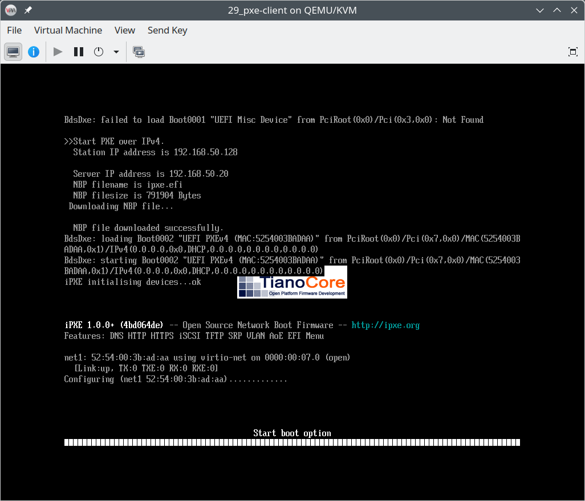
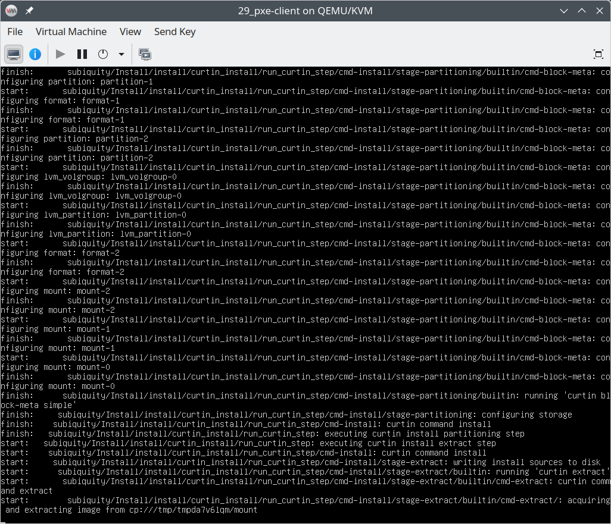
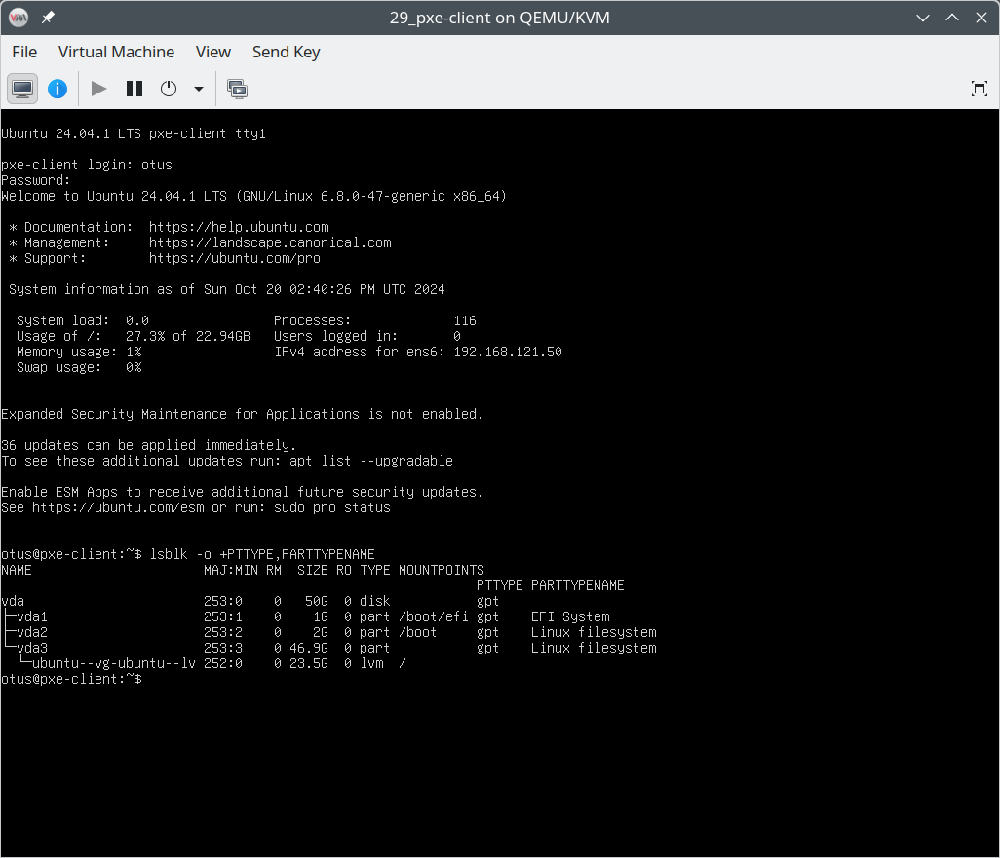

# Настройка PXE сервера для автоматической установки

## Задание

1. Настроить загрузку по сети дистрибутива **Ubuntu 24.04**
2. Установка должна проходить из **HTTP**-репозитория.
3. Настроить автоматическую установку c помощью файла **user-data**.

## Реализация

Задание сделано на **almalinux/9** версии **v9.4.20240805**. Для автоматизации процесса написаны следующие роли **Ansible**, переменные для которых хранятся в [host_vars/pxe-server.yml](host_vars/pxe-server.yml):

- **epel_release** - добавляет репозиторий **Extra Packages for Enterprise Linux (EPEL)**.
- **tftp_boot** - устанавливает **tftp** сервер и кладёт в его корень загрузчики **undionly.kpxe** и **ipxe-x86_64.efi** из пакета **ipxe-bootimgs-x86**.
- **netboot** - создаёт директорию `/var/www/netboot/ubuntu/configs` и кладёт в неё конфиги автоматической установки **ubuntu** [user-data](/roles/netboot/templates/user-data) и [meta-data](/roles/netboot/templates/user-data). Также в директории **netboot** обновляет файл [script.pxe](roles/netboot/templates/script.pxe) и скачивает ядро **linux**, **initramfs** и **iso** образ необходимый для сетевой установки. Используемые ссылки для скачивания указаны в [host_vars/pxe-server.yml](host_vars/pxe-server.yml), скачивание через Интернет может занять продолжительное время.
- **http_boot** - устанавливает **nginx** и конфигурирует его на отдачу файлов из каталога `/var/www/netboot`, помещая файл [httpboot.conf](roles/http_boot/templates/httpboot.conf) в `/etc/nginx/default.d`.
- **kea_dhcpv4** - устанавливает **kea dhcp server** и настраивает его для сетевой загрузки. Конфиг приведён в переменной **kea_dhcpv4_config** в файле роли [defaults/main.yml](roles/kea_dhcpv4/defaults/main.yml). В качестве загрузчика во всех режимах используется **iPXE**, который запускается с **tftp** или **http** сервера и повторно загружает скрипт [script.pxe](roles/netboot/templates/script.pxe) с **http**.

## Запуск

Для запуска требуется **libvirt** (так как **PXE** загрузка невозможна через **EFI** прошивку в **VirtualBox 7.1.0** на **Linux**). Установить плагин можно командой:

```shell
vagrant plugin install vagrant-libvirt
```

Необходимо скачать **VagrantBox** для **almalinux/9** версии **v9.4.20240805** и добавить его в **Vagrant** под именем **almalinux/9/v9.4.20240805**. Сделать это можно командами:

```shell
curl -OL https://app.vagrantup.com/almalinux/boxes/9/versions/9.4.20240805/providers/libvirt/amd64/vagrant.box
vagrant box add vagrant.box --name "almalinux/9/v9.4.20240805"
rm vagrant.box
```

После этого нужно сделать **vagrant up**. Скачивание **iso** образа **ubuntu** в виртуальную машину может занять продолжительное время.

Протестировано в **OpenSUSE Tumbleweed**:

- **Vagrant 2.3.7**
- **Ansible 2.17.5**
- **Python 3.11.10**
- **Jinja2 3.1.4**

## Проверка

Запускаем **PXE** клиент командами:

```shell
vagrant up pxe-client
virt-manager --connect qemu:///system --show-domain-console 29_pxe-client
```

Начинается сетевая загрузка. Видно, что используется режим **UEFI**:



Запускается автоматическая установка:



Система настроена на загрузку с первого диска, поэтому автоматически загрузится после установки. Зайдём под пользователем **otus** (пароль **123**) и проверим, что система установилась на **GPT** раздел и был создан **EFI** раздел командой `lsblk -o +PTTYPE,PARTTYPENAME`:


